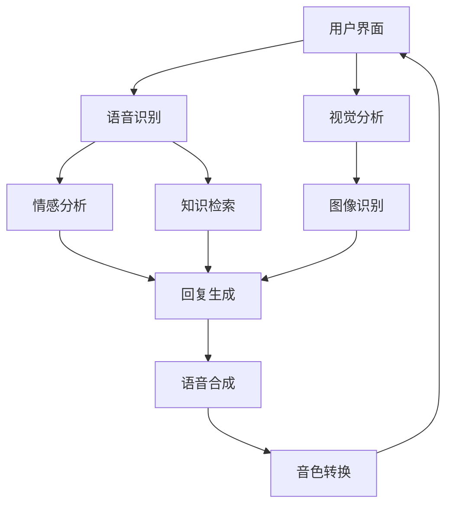
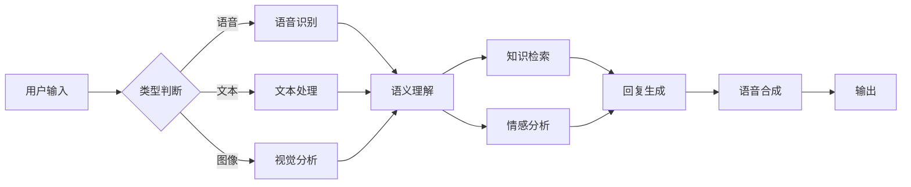

# 🤖 AI 语音助手

<div align="center">
</div>
<p align="center">一个智能语音助手系统，集成多模态交互、知识库检索和长期记忆能力</p>


## ✨ 特性

| 功能 | 描述 |
|------|------|
| 🎙️ 语音识别 | 实时识别用户语音并转换为文本 |
| 🔊 语音合成 | 自然流畅的文本到语音转换 |
| 🎭 情感分析 | 智能识别用户情感并作出回应 |
| 🧠 智能记忆 | 长期记忆系统支持连续对话 |
| 📚 知识检索 | 强大的知识库管理与检索能力 |
| 🌈 音色转换 | 使用 so-vits 提供多样化音色 |
| 👁️ 视觉分析 | 集成通义千问 VLM 的图像理解 |

## 🛠️ 技术架构

<div align="center">




### 🔧 核心组件

- 🖥️ **基础框架**
  - `Flask` & `FastAPI`: Web服务框架
  - `pyaudio` & `numpy`: 音频处理
  - `edge-tts`: 语音合成
  - `FunASR`: 语音识别

- 🧩 **AI 组件**
  - `AnythingLLM`: 知识库系统
  - `Ollama`: 本地大模型
  - `LETTA`: 长期记忆系统
  - `BERT`: 情感分析模型
  - `live2d`: live2d模型
  - `deepseek-r1`:llm模型
  - 

## 📂 项目结构

```
project/
├── 📁 edge-tts/
│   ├── 📄 edge-tts.py          # TTS 服务
│   ├── 📄 emotion_service.py   # 情感分析服务
│   ├── 📄 memory_service.py    # 记忆服务
│   ├── 📄 vlm.py              # 视觉分析服务
│   └── 📄 asr.py 				# 语音识别服务
│   └── 📄 flask_api_full_song.py 	# 声色转换服务
├── 📁 live2dSpeek/
│   ├── 📄 index.html          # 主页面
│   ├── 📄 style.css           # 样式文件
│   └── 📄 script.js           # 脚本文件
├── 📄 start_services.py        # 启动脚本
├── 📄 requirements.txt         # 项目依赖
└── 📄 README.md               # 项目文档
```

## 🚀 快速开始

### 环境要求

- 🐍 Python 3.8+
- 🐋 Docker
- 🎮 NVIDIA GPU (推荐)

### 安装步骤

1️⃣ **安装 Python 依赖**
```bash
pip install -r requirements.txt
```

2️⃣ **部署 AnythingLLM**
```bash
docker pull anything-llm:latest
docker run -d -p 3001:3001 anything-llm
```

3️⃣ **安装 Ollama**
```bash
curl https://ollama.ai/install.sh | sh
```

4️⃣ **配置 LETTA**
```bash
# 按照官方文档配置
```

### 🌟 启动服务

```bash
python start_services.py
# 安装http-server
npm install -g http-server
#运行页面
http-server .
```

## 📡 服务地址

| 服务 | 地址 | 状态 |
|------|------|------|
| TTS | http://127.0.0.1:2020 | ✅ |
| 情感分析 | http://127.0.0.1:5000 | ✅ |
| 记忆服务 | http://127.0.0.1:5090 | ✅ |
| 语音识别 | http://127.0.0.1:2021 | ✅ |
| 视觉分析 | http://127.0.0.1:7856 | ✅ |
| AnythingLLM | http://localhost:3001 | ✅ |
| ASR | http://127.0.0.1:2021 | ✅ |
| So-vits | http://127.0.0.1.1145 | ✅ |

## 📊 系统架构

<div align="center">



</div>

## 💡 使用说明

1. **语音交互**
   - 🎤 启动录音: `/start_record`
   - 🔍 实时识别转换
   - 🗣️ 自然语音回复

2. **知识检索**
   - 📚 自动检索相关信息
   - 🤖 本地模型推理
   - 🧠 长期记忆支持

3. **视觉分析**
   - 📸 支持图像理解
   - 🖼️ 场景描述
   - 👀 物体识别

## ⚠️ 注意事项

- 🎯 确保设备权限正确设置
- 🔌 检查服务连接状态
- 💾 定期维护知识库
- 🔄 监控系统资源使用

## 🤝 贡献

欢迎提交 Issue 和 Pull Request！

## 📄 许可证

MIT License © []

---

<div align="center">
Made with ❤️ by Your Team
</div>
